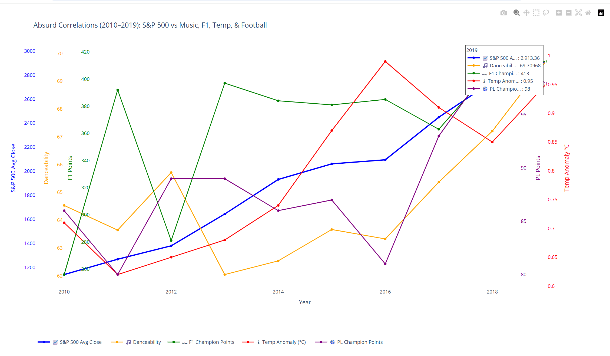

# 🌀 What Really Moves the Market? Absurd Correlations with the S&P 500  

**A humorous data storytelling project comparing the S&P 500 stock market performance with completely unrelated cultural, sporting, and environmental trends.**  

Because sometimes, the market moves for *mysterious* reasons… or maybe it’s just danceability and football points.  

---

## 🎯 Project Concept  

This project explores **absurd correlations** between the stock market and random external factors.  

Instead of trying to predict the S&P 500 with economic fundamentals, I deliberately compared it to metrics like:  

- 🎵 **Spotify Music Trends** – Average *danceability* of the year’s most popular songs  
- 🏎 **Formula 1 Champion Points** – How dominant the F1 World Champion was in that year  
- 🌡 **Global Temperature Anomalies** – Did the market rise along with the planet’s heat?  
- ⚽ **Premier League Champion Points** – Do record-breaking EPL seasons “coincide” with stock market gains?  

Finally, I trained a **Linear Regression model** to see if these absurd metrics could “predict” the S&P 500.  

---

## 📊 What I Actually Did  

✅ Collected **S&P 500 yearly average close (2010–2019)** via Yahoo Finance  
✅ Fetched **Spotify Top Songs data** from Kaggle (danceability, energy, tempo)  
✅ Used **historical F1 World Champion points** from Wikipedia  
✅ Added **global temperature anomaly data** from NASA  
✅ Scraped **Premier League Champion Points** from publicly available data  
✅ Combined all into a single dataset  
✅ Visualized all trends together in a **Plotly multi-series chart**  
✅ Ran a **Linear Regression** on absurd factors → achieved **MAE ~27.6** (totally meaningless!)  

---

## 🖼 Key Visualization  

  

This combined Plotly chart shows how *completely unrelated* trends loosely follow the same timeline as the S&P 500. It’s a playful way to show how you can always “find” a correlation.  

---

## 🔮 Fun Machine Learning Result  

I trained a **Linear Regression model** with these random features:  

- Danceability  
- F1 Champion Points  
- Global Temp Anomaly  
- Premier League Champion Points  

Surprisingly, it achieved **Mean Absolute Error: 27.6 points** for a 10-year dataset.  
But the “feature importance” was pure nonsense:  

- 🌡 **Temp Anomaly:** +2191.56 (apparently the “strongest predictor”)  
- ⚽ **Premier League Points:** +39.08  
- 🎵 **Spotify Danceability:** +20.65  
- 🏎 **F1 Champion Points:** +4.00  

Moral of the story: **ML will find *some* relationship even in meaningless data.**  

---

## 🗂 Data Sources  

| Signal | Dataset | Notes |  
|--------|---------|-------|  
| **S&P 500** | [Yahoo Finance API](https://pypi.org/project/yfinance/) | Yearly average close (2010–2019) |  
| **Spotify Trends** | [Kaggle Top Spotify Songs](https://www.kaggle.com/datasets/leonardopena/top-spotify-songs-from-20102019-by-year) | Avg danceability per year |  
| **F1 Champions** | Wikipedia (scraped manually) | Champion points per season |  
| **Global Weather** | [NASA GISTEMP](https://data.giss.nasa.gov/gistemp/) | Global temperature anomaly |  
| **Premier League** | Wikipedia (scraped manually) | Champion’s points per season |  

---

## 🛠 Tech Stack  

- **Python** → data wrangling with Pandas  
- **Plotly** → visualization  
- **scikit-learn** → Linear Regression model  
- **yfinance & Kaggle Datasets** → data collection  

---

## 🤔 Why This Project?  

- **Showcases data storytelling** with humor  
- **Highlights the danger of spurious correlations**  
- Demonstrates **data wrangling, visualization, and simple ML**  
- Adds a *memorable* portfolio piece that mixes **finance, culture, and sports**  

---

## 🚀 Output  

- ✅ **Multi-series visualization** of absurd correlations  
- ✅ **Simple ML model** proving you can fit nonsense to the stock market  
- ✅ **Screenshots + write-up** for portfolio  

---

## 💡 Key Takeaway  

*Correlation does not imply causation—especially when it involves danceability, football points, and the S&P 500!*  
